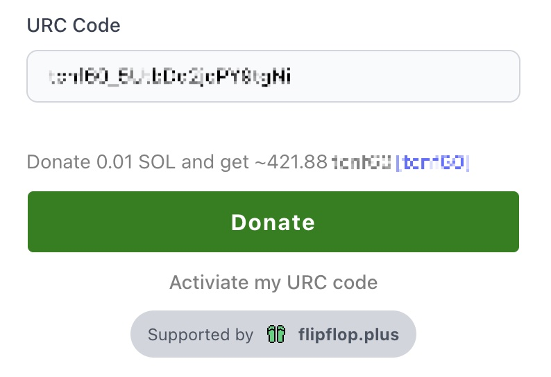

# FlipFlop SDK Tools

[](https://badge.fury.io/js/%40flipflop-sdk%2Ftools)
[](https://opensource.org/licenses/MIT)
[](http://www.typescriptlang.org/)

A comprehensive React SDK for integrating FlipFlop's Proof of Mint functionality into your Apps. This toolkit provides production-ready components for seamless token minting experiences with built-in wallet integration, error handling, and customizable UI components.



## 🚀 Quick Start

### Installation

```bash
npm install @flipflop-sdk/tools
# or
yarn add @flipflop-sdk/tools
# or
pnpm add @flipflop-sdk/tools
```

### Basic Usage
```
import { MintButton } from '@flipflop-sdk/tools';
import { useConnection, useWallet } from '@solana/
wallet-adapter-react';

function App() {
  const { connection } = useConnection();
  const wallet = useWallet();

  return (
    <MintButton
      mintAddress="your_token_mint_address"
      urcCode="your_urc_code"
      wallet={wallet}
      connection={connection}
    />
  );
}
```

## 📚 API Reference
### MintButton Component
The primary component for integrating Proof of Mint functionality.

#### Props
| Property           | Type                 | Required | Default     | Description                     |
|--------------------|----------------------|----------|-------------|---------------------------------|
| mintAddress        | string               | ✅        | -           | The Solana token mint address   |
| urcCode            | string               | ✅        | -           | Unique referral code for tracking |
| wallet             | AnchorWallet         | ✅        | -           | Connected Solana wallet instance |
| connection         | Connection           | ✅        | -           | Solana RPC connection           |
| buttonTitle        | string               | ❌        | "Mint"      | Custom button text              |
| buttonStyle        | CSSProperties        | ❌        | See defaults | Custom button styling          |
| informationStyle   | CSSProperties        | ❌        | See defaults | Token info display styling      |
| generateURCStyle   | CSSProperties        | ❌        | See defaults | URC generation link styling     |
| flipflopLogoStyle  | CSSProperties        | ❌        | See defaults | FlipFlop logo styling           |
| onStart            | () => void           | ❌        | -           | Callback fired when minting begins |
| onError            | (error: string) => void | ❌     | -           | Error handling callback         |
| onSuccess          | (data: SuccessResponseData) => void | ❌ | -       | Success callback with transaction data |

#### Types

```
interface SuccessResponseData {
  signature: string;
  mintAddress: string;
  amount: number;
  timestamp: number;
}

interface MintButtonProps {
  mintAddress: string;
  urcCode: string;
  wallet: AnchorWallet;
  connection: Connection;
  buttonTitle?: string;
  buttonStyle?: React.CSSProperties;
  informationStyle?: React.CSSProperties;
  generateURCStyle?: React.CSSProperties;
  flipflopLogoStyle?: React.CSSProperties;
  onStart?: () => void;
  onError?: (error: string) => void;
  onSuccess?: (data: SuccessResponseData) => void;
}
```

## 🎨 Styling & Customization
### Default Styles
The component comes with sensible defaults that can be overridden:

```
const defaultStyles = {
  button: {
    padding: '10px',
    border: '1px solid #ccc',
    cursor: 'pointer',
    borderRadius: '4px',
    backgroundColor: '#ffffff',
    transition: 'all 0.2s ease-in-out',
  },
  information: {
    display: 'flex',
    justifyContent: 'center',
    fontSize: '12px',
    color: '#666666',
  },
  generateURC: {
    display: 'flex',
    justifyContent: 'center',
    fontSize: '14px',
    color: '#0066cc',
  },
  flipflopLogo: {
    display: 'flex',
    justifyContent: 'center',
    opacity: 0.8,
  },
};
```

### Custom Styling Example
```
<MintButton
  mintAddress="your_mint_address"
  urcCode="your_urc_code"
  wallet={wallet}
  connection={connection}
  buttonTitle="Mint NFT"
  buttonStyle={{
    padding: '16px 32px',
    backgroundColor: '#6366f1',
    color: 'white',
    border: 'none',
    borderRadius: '8px',
    fontSize: '16px',
    fontWeight: '600',
    boxShadow: '0 4px 6px -1px rgba(0, 0, 0, 0.1)',
    transition: 'all 0.2s ease-in-out',
  }}
  informationStyle={{
    marginTop: '12px',
    padding: '8px',
    backgroundColor: '#f8fafc',
    borderRadius: '6px',
    fontSize: '14px',
  }}
/>
```

## 🔧 Advanced Usage
### Error Handling
```
const handleMintError = (error: string) => {
  // Custom error handling logic
  console.error('Mint failed:', error);
  
  // Show user-friendly error message
  toast.error(`Minting failed: ${error}`);
  
  // Track error for analytics
  analytics.track('mint_error', { error, mintAddress });
};

<MintButton
  // ... other props
  onError={handleMintError}
/>
```
### Success Handling
```
const handleMintSuccess = (data: SuccessResponseData) => {
  console.log('Mint successful:', data);
  
  // Show success message
  toast.success(`Successfully minted! Signature: ${data.signature}`);
  
  // Redirect or update UI
  router.push(`/transaction/${data.signature}`);
  
  // Track success for analytics
  analytics.track('mint_success', data);
};

<MintButton
  // ... other props
  onSuccess={handleMintSuccess}
/>
```

### Loading States
```
const [isMinting, setIsMinting] = useState(false);

<MintButton
  // ... other props
  buttonTitle={isMinting ? 'Minting...' : 'Mint Token'}
  buttonStyle={{
    ...defaultButtonStyle,
    opacity: isMinting ? 0.7 : 1,
    cursor: isMinting ? 'not-allowed' : 'pointer',
  }}
  onStart={() => setIsMinting(true)}
  onSuccess={() => setIsMinting(false)}
  onError={() => setIsMinting(false)}
/>
```
## 🏗️ Development
### Building from Source
```
# Clone the repository
git clone https://github.com/flipflop-fun/sdk.git
cd flipflop-sdk

# Install dependencies
npm install

# Build the project
npm run build

# Run in development mode
npm run dev
```

## 🌐 Browser Support
- Chrome/Chromium 88+
- Firefox 85+
- Safari 14+
- Edge 88+
## 📖 Examples
### Next.js Integration
```
// pages/_app.tsx
import { WalletAdapterNetwork } from '@solana/wallet-adapter-base';
import { ConnectionProvider, WalletProvider } from '@solana/wallet-adapter-react';
import { WalletModalProvider } from '@solana/wallet-adapter-react-ui';
import { PhantomWalletAdapter } from '@solana/wallet-adapter-wallets';
import { clusterApiUrl } from '@solana/web3.js';

const network = WalletAdapterNetwork.Mainnet;
const endpoint = clusterApiUrl(network);
const wallets = [new PhantomWalletAdapter()];

function MyApp({ Component, pageProps }) {
  return (
    <ConnectionProvider endpoint={endpoint}>
      <WalletProvider wallets={wallets} autoConnect>
        <WalletModalProvider>
          <Component {...pageProps} />
        </WalletModalProvider>
      </WalletProvider>
    </ConnectionProvider>
  );
}
```
### React + Vite Integration
```
// main.tsx
import { Buffer } from 'buffer';

// Polyfill for browser compatibility
window.Buffer = Buffer;

// Your app code
import App from './App';
ReactDOM.render(<App />, document.getElementById('root'));
```

## 🚨 Common Issues
### Buffer is not defined
```
npm install buffer
```
```
// Add to your bundler config or main entry file
import { Buffer } from 'buffer';
window.Buffer = Buffer;
```
### Wallet Connection Issues
Ensure your wallet provider is properly configured and the user has connected their wallet before rendering the MintButton.

### Network Mismatch
Verify that your connection endpoint matches the network where your token is deployed.

## 🤝 Contributing
We welcome contributions! Please see our Contributing Guide for details.

### Development Workflow
1. Fork the repository
2. Create a feature branch: git checkout -b feature/amazing-feature
3. Make your changes
4. Add tests if applicable
5. Commit your changes: git commit -m 'Add amazing feature'
6. Push to the branch: git push origin feature/amazing-feature
7. Open a Pull Request
## 📄 License
This project is licensed under the MIT License - see the LICENSE file for details.

## 🔗 Links
- [FlipFlop Website](https://flipflop.plus)
- Documentation
- GitHub Repository
- NPM Package
- Discord Community

## 🏷️ Changelog
See CHANGELOG.md for a detailed history of changes.

Built with ❤️ by the FlipFlop Team
